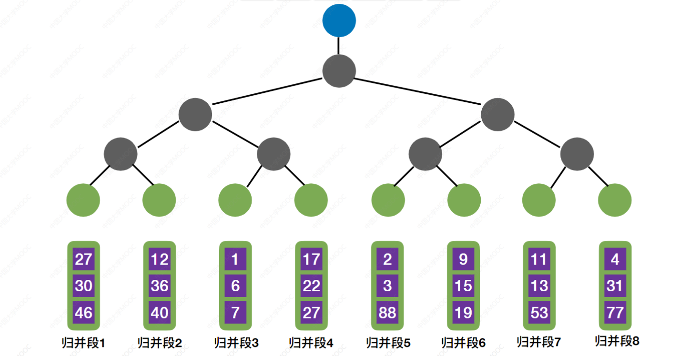
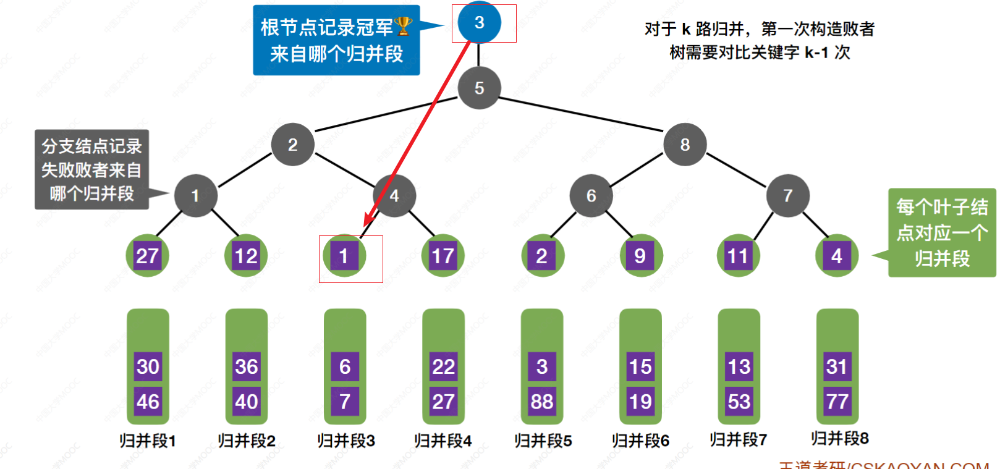

# 前言

前面介绍过的排序方法都是在内存中进行的(称为内部排序)。而在许多应用中，经常需要对大文件进行排序，因为文件中的记录很多，无法将整个文件复制进内存中进行排序。因此，需要将待排序的记录存储在外存上，排序时再把数据一部分一部分地调入内存进行排序，在排序过程中需要多次进行内存和外存之间的交换。这种排序方法就称为外部排序。

# 时间开销

外部排序时间开销 = 读写外存的时间+内部排序时间+内部归并时间

注意：归并排序每一次将两个有序的子序列进行归并，所以在归并排序开始之前我们首先要构造一些已经有序的子序列。

所以我们将磁盘块读入内存之后，采用内部排序就可以将其构造为有序的磁盘块，然后将其写回对应的磁盘块。在此过程中，所有要被排序的磁盘块均进行一次磁盘读写操作（一次读+一次写）

如果分配的内存缓冲区更大的话，我们得到的初始归并段的长度也更长，初始归并段的数量也就更少

有了初始归并段（有序）之后我们就可以开始归并操作了（内部归并排序）

# 优化

优化方向：减少归并次数也就会减少总的磁盘IO次数

## 多路归并

采用多路归并的话，一次可以归并更多个归并段，所以归并趟数会减少，总的磁盘IO次数也会减少

### 计算
对$r$个初始归并段，做$k$路归并，则归并树可用$k$叉树表示，若树高为$h$，则归并趟数=$h-1 = \lceil \log_kr\rceil$

推导：$k$叉树第$h$层最多有$k^{h-1}$个节点，则$r\leqslant k^{h-1}, (h-1)_{最小} = \lceil \log_kr\rceil$

$k$越大，$r$越小，归并趟数越少，读写磁盘次数越少，我们优化归并操作的时候就优化这两个参数

### 负面影响

1. k路归并时，需要开辟k个输入缓冲区，内存开销增加。
2. 每挑选一个关键字需要对比关键字$(k-1)$次，内部归并所需时间增加，也就是说多路归并的路数不可能无限的增大

### 败者树（优化多路归并）

使用k路平衡归并策略，选出一个最小元素需要对比关键字$(k-1)$次，导致内部归并所需时间增加
#### 示意图

## 减少初始归并段的数量

生成初始归并段的“内存工作区”越大，初始归并段越长

增加输入缓冲区的数量，这样就可以在构造初始归并段阶段读入更多磁盘块，进行内部排序之后，有序的初始归并段的长度也就更长，总的初始归并段数量也就更少。

若共$N$个记录，内存工作区可以容纳$L$个记录，则初始归并段数量$r = ⌈N/L⌉$，**初始归并段的数量完全取决于内存工作区的大小**

### 置换选择排序
